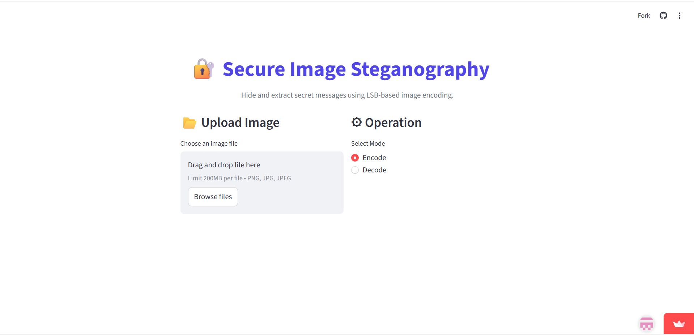
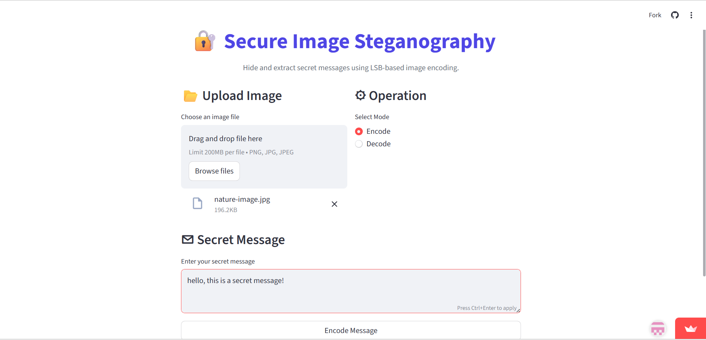
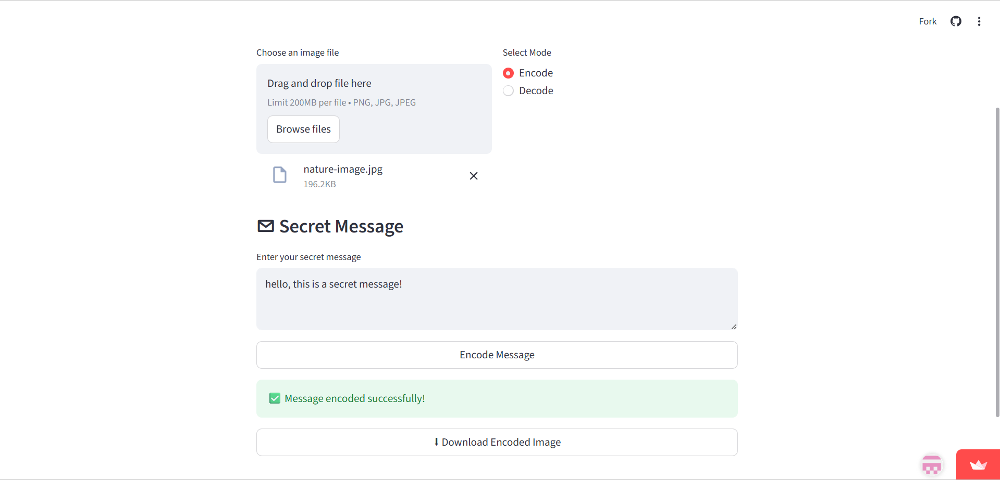
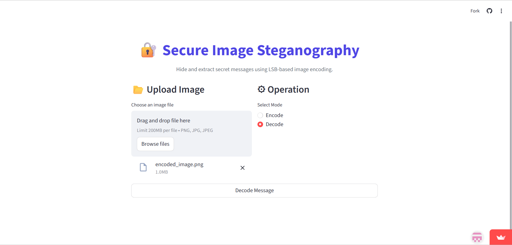
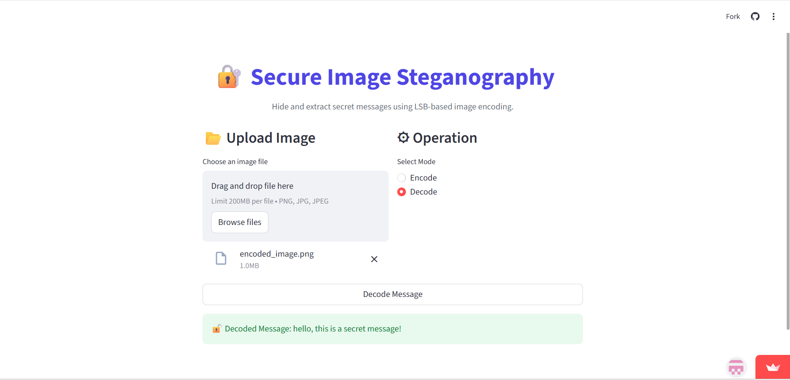

# 🔐 Secure Image Steganography

An interactive **Python web application** that hides and extracts secret messages inside digital images using **Least Significant Bit (LSB) steganography**.

Built with **Streamlit, OpenCV, and NumPy**, the application allows users to securely embed text inside images and retrieve hidden messages through a simple browser interface.

---

## 🚀 Live Demo

🔗 https://secure-image-steganography.streamlit.app/

---

## 📸 Screenshots

### Application Interface
Upload an image and choose whether to encode or decode a hidden message.



---

### Enter Secret Message
Upload an image and type the message you want to hide.



---

### Message Encoded Successfully
The application embeds the secret message into the image and allows the user to download the encoded image.



---

### Upload Encoded Image for Decoding
Upload the encoded image to extract the hidden message.



---

### Decoded Hidden Message
The hidden message is successfully extracted from the encoded image.



---

## 📖 Overview

This application allows users to:

- Encode secret messages inside images
- Decode hidden messages from encoded images
- Detect whether an image contains embedded data
- Preserve image quality using minimal bit modification

The entire application runs in the **browser** while the processing is handled by **Python**.

---

## ⚙️ How It Works

Digital images consist of pixels, and each pixel contains three color channels:

- Red  
- Green  
- Blue  

Each channel stores values between **0–255**, represented in **binary format**.

### Encoding Process

1. The input message is converted into binary.
2. The **Least Significant Bit (LSB)** of each pixel channel is modified.
3. A special delimiter (`#####`) is appended to mark the end of the message.
4. The modified image is generated and provided for download.

### Decoding Process

1. Extract LSB bits from the image.
2. Convert binary data back into text.
3. Search for the delimiter.
4. If the delimiter exists → display the hidden message.  
   If not → show **"No hidden message found."**

Because only the **last bit of each channel** is modified, the visual difference in the image is nearly invisible.

---

## ✨ Features

✔ LSB-based steganography implementation  
✔ Encode and decode secret messages  
✔ Binary-to-text and text-to-binary conversion  
✔ Automatic hidden message detection  
✔ Graceful handling of non-encoded images  
✔ Downloadable encoded image output  
✔ Clean and interactive Streamlit interface  

---

## 🛠 Tech Stack

**Language**
- Python

**Libraries**
- OpenCV  
- NumPy  
- Streamlit  

---

## 📂 Project Structure

```
secure-image-steganography/
│
├── app.py
├── requirements.txt
├── runtime.txt
├── .gitignore
├── README.md
│
└── screenshots/
├── interface.png
├── encode-message.png
├── encoded-success.png
├── decode-message.png
└── decoded-success.png
```

---

## ▶️ Run Locally

### 1. Clone the repository

```
git clone https://github.com/salmashaik45/secure-image-steganography.git

cd secure-image-steganography
```


### 2. Install dependencies

```
pip install -r requirements.txt
```

### 3. Run the application

```
python -m streamlit run app.py
```

The application will automatically open in your browser.

---

## 👩‍💻 Author

**Salma Shaik**  
Computer Science and Engineering Student  

🔗 GitHub: https://github.com/salmashaik45